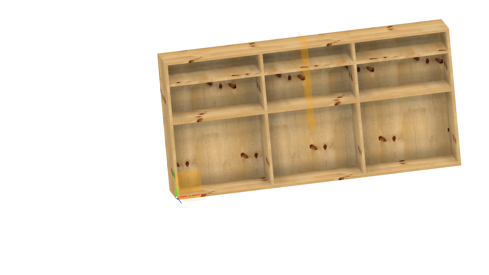
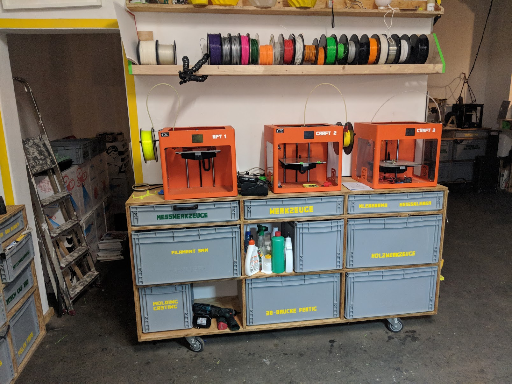

# erfindergarden-sideboard
This is the sideboard we built in erfindegarden. 

It is build so Euroboxes fit in it. 

We are at the moment letting every new member of erindergarden design a handle for the boxes as its quite difficult to get the heavy boxes out. 

I finally managed to model it in fusion and made a version with taps i want to laser cut and also mill soon.

## Material

* Seekiefer 18mm (maritime pine)
* Screws (specifiy length)
* kreg pocket scew jig

## How can you help?

* model the boxes
* model a handle
* make in your lab

## Designer

Andreas Kopp

[andreas@erfindergarden.de](mailto:andreas@erfindergarden.de)

# Contact erfinderarden

Made and designed at erfindergarden

[www.erfindergarden.de](http://www.erfindergarden.de)

[www.facbebook.com/erfindergarden](http://www.facbebook.com/erfindergarden)

## Credits
 
The idea for the sideboard is from the Fablab berlin. The founder send me the design a carpenter made for the.

Kat modeled it in Rhino and Mini helped to build it. 

## License

This project is [Attribution-ShareAlike 2.5 Generic (CC BY-SA 2.5)](https://creativecommons.org/licenses/by-sa/2.5/). You can do anything what you want with it but please say that you got the original design from erfindergarden and als share it under the same license. 

For more information, see [license](license.md). 
